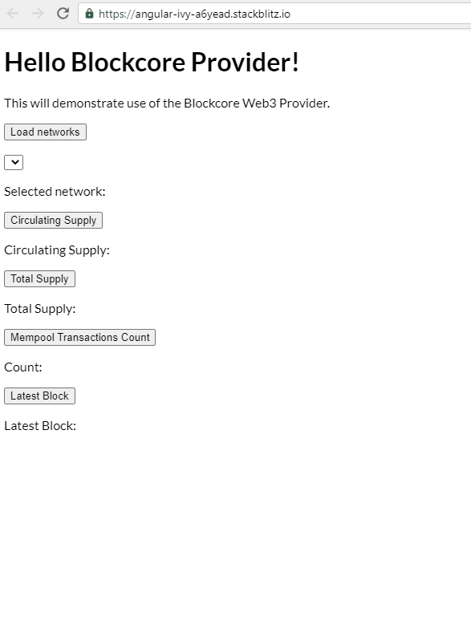

<p align="center">
  <p align="center">
    
  </p>
  <h3 align="center">
    Blockcore Web Provider
  </h3>
  <p align="center">
    Multi-Chain Web Provider for Blockcore
  </p>
  <p align="center">
      <a href="https://github.com/block-core/blockcore-provider/actions/workflows/build.yml"></a> <a href="https://github.com/block-core/blockcore-provider/actions/workflows/release.yml"></a>
  </p>
  <p align="center"><em>Work-in-Progress - use with caution!</em></p>
</p>

# Blockcore Web Provider

Web (Web3/Web5) Provider for Blockcore.

The provider is how apps talks to the blockchains. Providers take JSON-RPC requests and return the response. This is normally done by submitting the request to an HTTP or IPC socket based server.

The provider also allows connection to be made between web site / web app and the Blockcore Wallet (browser extension).

## Setup

Install:

```sh
npm install @blockcore/provider
```

**Warning:** This package is native [ESM](https://developer.mozilla.org/en-US/docs/Web/JavaScript/Guide/Modules) and does not provide a CommonJS export. If your project uses CommonJS, you'll have to [convert to ESM](https://gist.github.com/sindresorhus/a39789f98801d908bbc7ff3ecc99d99c) or use the [dynamic `import()`](https://v8.dev/features/dynamic-import) function.

## Usage

```ts
import { Provider } from '@blockcore/provider';

let provider = new Provider();
const result: any = await provider.getCirculatingSupply();
```


Screen recording demonstrating the use of the Blockcore Web Provider:



## Interactive editor

You can start testing the provider using this ready made Stackblitz:

https://stackblitz.com/edit/angular-ivy-a6yead?file=src/app/app.component.ts

